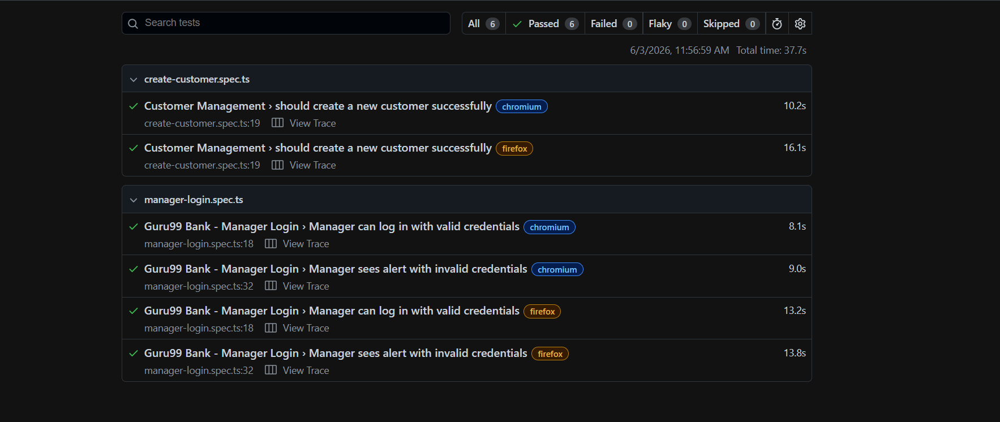

# Playwright + TypeScript QA Automation Portfolio

End-to-end test automation for the [Guru99 Banking demo app](https://demo.guru99.com/V4/) using Playwright and TypeScript, following the Page Object Model pattern.

Built as a portfolio project to demonstrate professional QA automation practices.

---

## Test Coverage

| Test File | Scenario | Browsers |
|---|---|---|
| `manager-login.spec.ts` | Manager login with valid credentials | Chromium, Firefox |
| `manager-login.spec.ts` | Manager login with invalid credentials (alert dialog) | Chromium, Firefox |
| `create-customer.spec.ts` | Create new customer and verify success message | Chromium, Firefox |

**3 tests × 2 browsers = 6 total**

---

## Tech Stack

- [Playwright](https://playwright.dev/) — browser automation and test runner
- TypeScript — type-safe test code
- Page Object Model — clean separation of locators and test logic
- dotenv — credential management via `.env` (never hardcoded)
- Cross-browser — Chromium and Firefox

---

## Project Structure
shakran-qa-portfolio-playwright/
├── pages/
│   ├── ManagerLoginPage.ts       # Login page locators and actions
│   └── CustomerCreatePage.ts     # New customer form locators and actions
├── tests/
│   ├── manager-login.spec.ts     # Login tests (positive + negative)
│   └── create-customer.spec.ts   # Customer creation test
├── docs/
│   └── report-screenshot.png     # Passing test report screenshot
├── Results/                      # Timestamped HTML reports (gitignored)
├── .env.example                  # Credential template for reviewers
├── playwright.config.ts          # Playwright configuration
└── tsconfig.json                 # TypeScript configuration

---

## Test Report

All 6 tests passing across Chromium and Firefox:



---

## How to Run

**1. Clone the repo**
```bash
git clone https://github.com/shakransiddiqui-official/shakran-qa-portfolio-playwright.git
cd shakran-qa-portfolio-playwright
```

**2. Install dependencies**
```bash
npm install
npx playwright install chromium firefox
```

**3. Set up credentials**
```bash
cp .env.example .env
# Open .env and fill in your Guru99 credentials
```

**4. Run the tests**
```bash
npx playwright test
```

**5. View the HTML report**
```bash
npx playwright show-report "Results/test-report <timestamp>"
```

---

## Key Implementation Notes

- **Page Object Model**: each page has its own class with readonly locators and action methods — tests stay clean and readable
- **Cross-browser dialog handling**: Guru99's login failure triggers a native browser `alert()`. Used `page.waitForEvent('dialog')` instead of `page.on('dialog')` for reliable cross-browser support including Firefox headless
- **Credential security**: login credentials stored in `.env` (gitignored). `.env.example` provided as a template
- **Sequential execution**: `workers: 1` prevents flakiness on the Guru99 demo server under parallel load

---

## Author

**Shakran Siddiqui** — QA Automation Engineer  
[GitHub](https://github.com/shakransiddiqui-official) · Chittagong, Bangladesh
